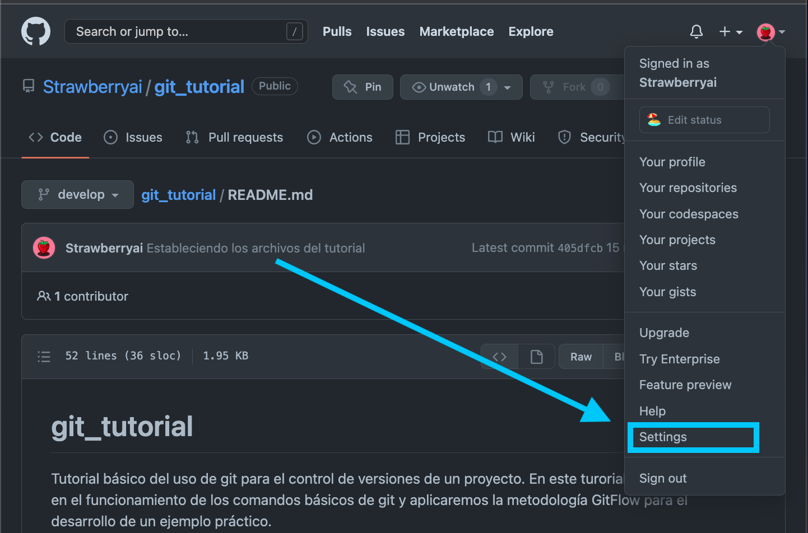
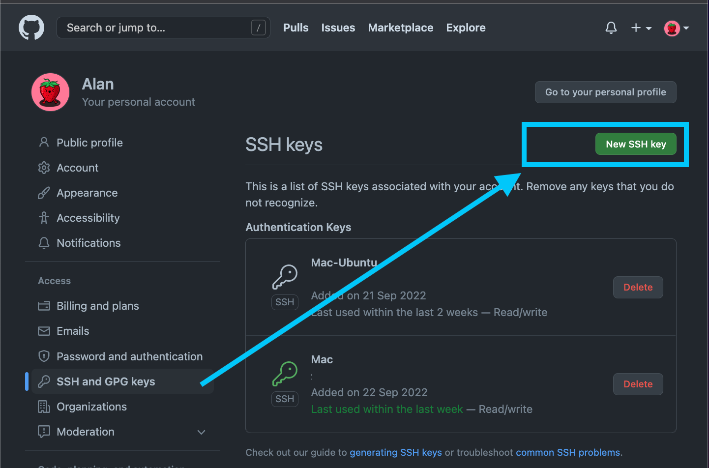
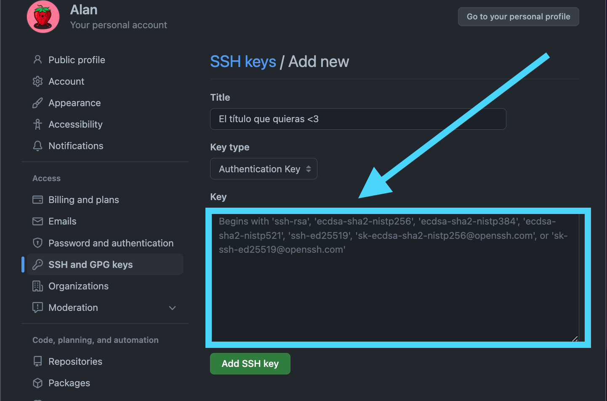

# git_tutorial

Tutorial básico del uso de git para el control de versiones de un proyecto. En
este turorial nos centraremos en el funcionamiento de los comandos básicos de
git y aplicaremos la metodología GitFlow para el desarrollo de un ejemplo
práctico.

# Instalación y configuración

En este turorial vamos a hacer uso de varias herramientas. Entre ellas
necesitaremos una cuenta de GitHub, un cliente de git y Python3 intalado.

## Cuenta de GitHub

En esta formación emplearemos [GitHub](https://github.com/) ya que es el hosting que emplearemos en
nuestro desarrollo futuro. Sin embargo, las metodologías expuestas en este
tutorial se pueden extrapolar a cualquier servicio de git hosting: [GitLab](https://about.gitlab.com/),
[BitBucket](https://bitbucket.org/)...

## Cliente git

Los clientes git testeados para esta formación son los siguientes (tanto MacOS
como Windows):

- [GitKraken](https://www.gitkraken.com/)
- [SourceTree](https://www.sourcetreeapp.com/)
- Git command (terminal)

Sin embargo, no habría ningún problema en emplear algún otro cliente.
En caso de optar por el comando git desde la terminal necesitaremos realizar
una configuración inicial para emplearlo con GitHub.

## Configuración del comando git

Instalamos el comando git con nuestro gestor de paquetes:
```
sudo apt install git #En Debian
brew install git #En MacOS
```
> Suponemos que ya tenemos un sistema con una terminal bash-like instalada.

A continuación, ejecutamos los siguientes comandos para configurar nuestro
usuario: 
```
git config --local user.name --local [tu_nombre]
git config --local user.email [tu_email]
```

Finalmente necesitaremos generar un par de claves SSH para la conexión por
GitHub y poder subir los cambios realizados a la plataforma. Si ocurre
cualquier problema con la conexión por ssh visitar [esta página](https://docs.github.com/en/authentication/connecting-to-github-with-ssh). 
En una terminal ejecutamos el siguiente comando (sustituyendo el email):

```
ssh-keygen -t ed25519 -C [your_email@example.com]
cat ~/.ssh/id_ed25519.pub
```

Copiamos la clave y la pegamos en el siguiente textarea:





# Conceptos básicos

Git es un sistema de control de versiones distribuido, mediante el cual podemos
trabajar a nivel local sin comprometer el repositorio principal en cada cambio
que realicemos. En otras palabras, es una forma de trabajar en la que cada
persona del proyecto tiene una copia y si se hace un estropicio pueden no
publicarse los cambios al proyecto principal o se pueden recuperar versiones
anteriores del mismo.

Gracias a este sistema, los desarrolladores del proyecto podrán trabajar de 
forma independiente hasta el momento en el que tengan que poner en común con 
el resto del equipo su código, controlando los cambios en las versiones y 
mejorando el seguimiento al desarrollo.

## ¿Qué es un commit?

## ¿Qué es un branch?

## ¿Qué es un remote?

